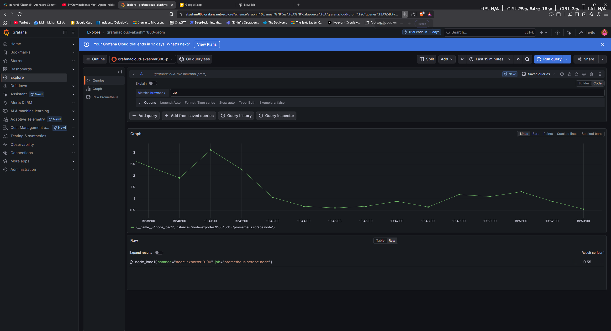
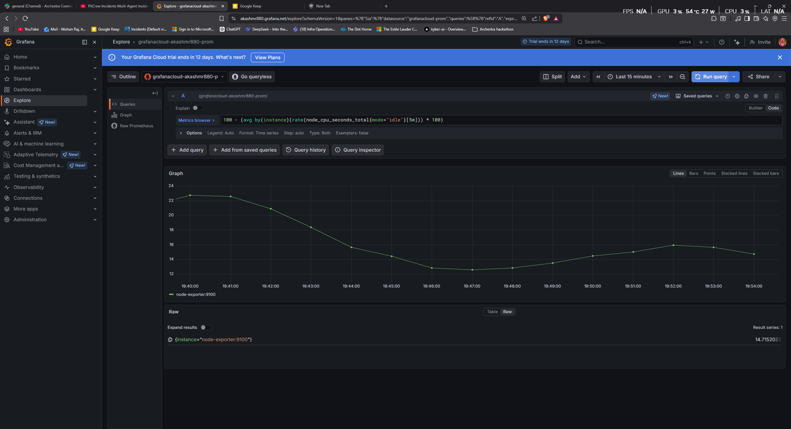
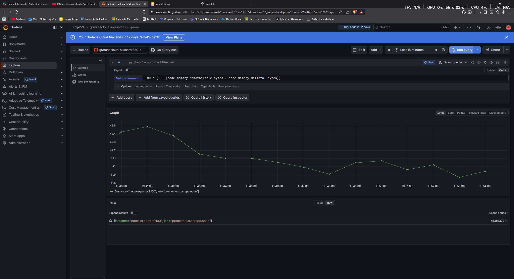
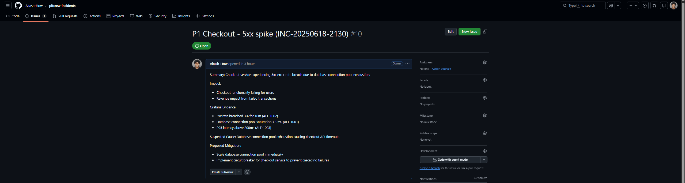
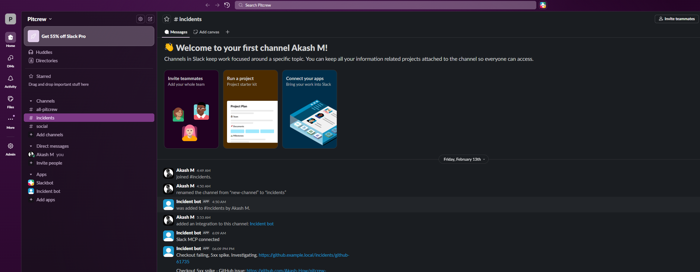
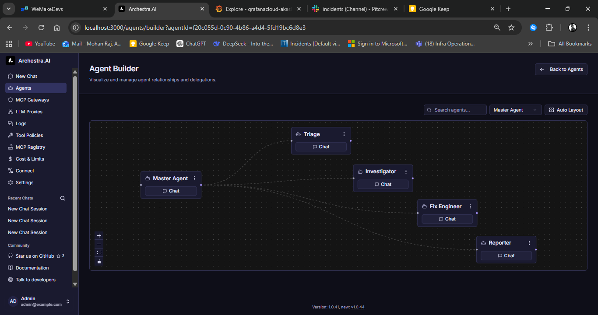
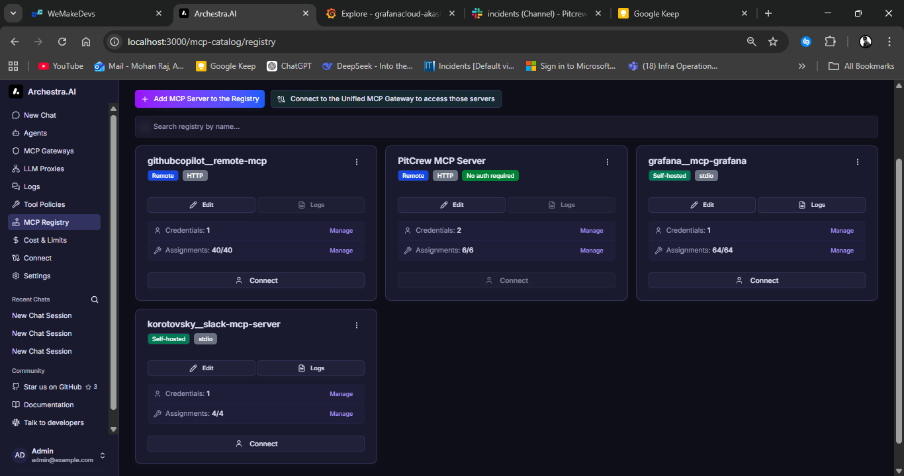

# PitCrew Multi-Agent Incidents
Tool-driven multi-agent incident response in Archestra (Grafana + GitHub + Slack MCP).

---

## Overview

PitCrew Multi-Agent Incidents is a production-style incident response workflow built on **Archestra**.

Given a live alert (Grafana) or an incident trigger, PitCrew coordinates multiple specialized agents to:

- Triage severity and blast radius
- Investigate the root cause using metrics and evidence
- Create a GitHub issue with a structured remediation plan
- Post real-time updates to Slack
- Generate a final incident report artifact (PDF)

This project demonstrates how Archestra can be used to orchestrate an end-to-end incident lifecycle across real infrastructure tooling.

---

## Demo

- **Video:** https://www.youtube.com/watch?v=OLO5L_fgJeY
- **Repository:** https://github.com/Akash-How/pitcrew-incidents

---

## Key Capabilities

### Multi-Agent Incident Response
PitCrew coordinates 4 specialized agents:

- **TRIAGE** : severity, scope, initial checks  
- **INVESTIGATOR** : evidence-driven RCA using Grafana metrics  
- **FIX ENGINEER** : safe mitigation + fix plan + GitHub ticket  
- **REPORTER** : stakeholder summary + Slack update + final report  

---

### Tool Integrations (MCP)

This workflow is powered by real tool execution using MCP integrations:

- **Grafana MCP** : fetch metrics and alert context  
- **GitHub MCP** : create and update issues  
- **Slack MCP** : post incident updates in a dedicated channel  

---

### Incident Artifact Generation
At the end of every incident run, PitCrew generates a structured PDF report containing:

- Incident timeline
- Metrics evidence
- Root cause hypothesis
- Fix plan
- Next actions

---

## Architecture

At a high level, PitCrew uses Archestra as the orchestration and governance layer.

**Execution flow:**

1. Alert enters the workflow (Grafana)
2. TRIAGE agent assesses severity and scope
3. INVESTIGATOR pulls metrics and correlates evidence
4. FIX ENGINEER drafts remediation and creates GitHub issue
5. REPORTER posts final status updates to Slack
6. A PDF incident artifact is produced for auditability

---

## Agent Roles and Responsibilities

| Agent | Responsibility | Output |
|------|----------------|--------|
| TRIAGE | Severity, blast radius, initial checks | SEV classification + next steps |
| INVESTIGATOR | Evidence collection and RCA | Root cause hypothesis + supporting metrics |
| FIX ENGINEER | Mitigation + fix plan | GitHub issue with structured remediation |
| REPORTER | Stakeholder comms + summary | Slack updates + final PDF report |

---

## Evidence: Grafana Metrics

The incident workflow pulls real-time system signals from Grafana.

### Service Health (UP)


### CPU Utilization


### Memory Utilization


### Network Traffic


---

## Evidence: GitHub + Slack Automation

### GitHub Issue Creation (Fix Plan + Tracking)


### Slack Incident Updates 


---

## Archestra Workflow Evidence

### Agent Workflow Execution


### MCP Registry Setup (Tool Connections)


---

## Incident Report Artifact (PDF)

A structured incident report is generated as a final output artifact:

- [View sample incident report (PDF)](./demo/artifacts/Artifact_Incident_report.pdf)

---

## Project Structure

```text
.
├── archestra/                     # Archestra workflow config
├── src/                           # Workflow + agent logic
├── pitcrew-grafana-metrics/       # Grafana + telemetry setup
├── demo/
│   ├── screenshots/               # Evidence screenshots used in README
│   └── artifacts/                 # Final incident report PDF
└── README.md
